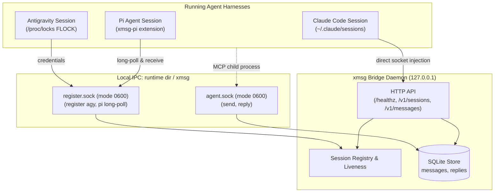

# xmsg: Local Inter-Agent Messaging & Coordination Bridge

`xmsg` is a fast, lightweight local messaging bridge connecting running AI agent sessions across harnesses (Claude Code, Antigravity, and Pi) on the local host. It provides direct, zero-overhead inbox delivery, attested caller identification, persistent reply threading, and MCP tooling.

---

## 1. Security Architecture & Trust Model

### 1.1 Same-UID Trust Boundary

All local IPC in `xmsg` relies on Unix domain sockets located in `$XDG_RUNTIME_DIR/xmsg/` (`http.sock`, `agent.sock`, `register.sock` in mode `0700` directory, socket mode `0600`, owned by the running user's UID). On macOS, when `XDG_RUNTIME_DIR` is unset, the runtime dir is the per-user Darwin temp dir (`getconf DARWIN_USER_TEMP_DIR`, also a `0700` directory):

- Sockets authenticate connected peers via kernel-attested credentials (`SO_PEERCRED` on Linux, `getpeereid` and `LOCAL_PEEREPID` on macOS). On macOS the peer PID is the last process to use the socket, not the one that connected as with `SO_PEERCRED`; they differ only when a connected socket is shared between processes before `accept`, and the UID check is unaffected.
- Any process executing under the **same local UID** is within the trust boundary and may connect to the Unix sockets.
- Sockets are protected against symlink attacks and race conditions on startup by verifying directory ownership and permissions prior to binding.
- All HTTP API endpoints are exposed over `$XDG_RUNTIME_DIR/xmsg/http.sock` by default. Every connection undergoes a peer UID check (`peer_uid == server_uid`) before HTTP framing, dropping connections from other UIDs immediately.

### 1.2 No-Authentication HTTP Posture & Unix-Socket Default

> [!WARNING]
> **No-Auth HTTP Service**: The `xmsg` HTTP server provides **no application-level authentication mechanisms**. It relies on Unix domain socket peer credentials (`SO_PEERCRED` / `getpeereid`) for access control.
>
> By default, `xmsg serve` binds **no TCP port whatsoever**. It listens solely on the local Unix domain socket `$XDG_RUNTIME_DIR/xmsg/http.sock`.
>
> A TCP loopback listener is available **only** when explicitly requested via the `--listen <IP:PORT>` CLI flag or `XMSG_LISTEN` environment variable. This is intended strictly for container / Kubernetes pod environments where loopback is an isolated, private network namespace. Never bind TCP to external or shared interfaces.

### 1.3 Attestation & Identity Derivation

`xmsg` prevents cross-session and cross-harness impersonation among non-adversarial same-UID processes:

- **Claude Sessions:** Discovered via configured session directories (defaulting to `~/.claude/sessions`). In multi-tenant setups (such as `genie` running one `CLAUDE_CONFIG_DIR` per subscription token, where each user has separate session directories), `xmsg` accepts multiple session directories via repeatable `--sessions-dir` flags or colon-separated paths in `XMSG_SESSIONS_DIR`. Process liveness and starttime continuity are verified via `/proc/<pid>/stat` (on macOS via `proc_pidinfo`, matching to the second the UTC `ps -o lstart` text Claude Code records as `procStart`; local-time renderings are rejected). Session IDs are globally unique; if the same ID appears across multiple directories, an error is logged once and the duplicate session is excluded from listing and delivery (fail-closed).
- **Antigravity Sessions:** Verified via dual attestation: the registering peer's ancestor chain is traversed to find a process matching a configured trusted executable (`--agy-exe`) that has the presence lock file descriptor `<presence_dir>/<conversation_id>.lock` open (matched by canonical device and inode numbers). The server derives the session key `agy:<pid>:<starttime>`, and subsequent liveness is tracked by PID and start time. On Linux, `/proc/locks` is checked additionally to confirm exclusive FLOCK ownership. On macOS, Darwin XNU kernel does not expose unprivileged APIs to identify the holder of a BSD `flock(2)` lock (`proc_pidfdinfo` has no lock state, and while `fcntl(F_GETLK)` queries the per-vnode lock list and can detect conflicting `F_FLOCK` locks via `lf_getlock` in `bsd/kern/kern_lockf.c`, it sets `fl->l_pid = -1` because non-POSIX flock locks record no owner PID). Thus Darwin provides no unprivileged API to attribute `flock(2)` ownership to a specific PID or distinguish the active holder from an exec-inheritor. macOS operates under Option B: verifying the trusted executable (`proc_pidpath`) and open file descriptor vnode `(vst_dev, vst_ino)` without FLOCK holder verification, accepting that inherited descriptors across exec satisfy the check (documented in `docs/probes/macos-agy.md`).
- **Pi Sessions:** Session identity is **server-derived** from attested kernel process parameters:
  ```text
  sessionId = "pi:" || peer_pid || ":" || starttime
  ```
  Caller-asserted session IDs in registration payloads are completely ignored.
- **Process Verification (Pi):** Pi sessions register via Unix domain socket (`register.sock`, mode 0600 in a 0700 runtime directory) and are admitted on the peer UID check alone (`SO_PEERCRED` / `LOCAL_PEERCRED`). Because `register.sock` is accessible only by the owning user, who already possesses permissions to inspect or trace processes on their own bus, executable and script attestation add no trust on a user's own bus. The server verifies that the peer UID matches the server UID, records process starttime for lifecycle tracking, and derives `sessionId = "pi:" || peer_pid || ":" || starttime`.
- **Fail-Closed Executable Resolution:** Executable path resolution fails closed on deleted binaries (`<path> (deleted)`) and upgraded profile symlinks where the canonical target has changed or no longer exists.
- **Attested Badges & Harness Binding:** The attested sender badge formats as:
  ```text
  fromName = "xmsg@" || host_label || " · " || caller.harness || ":" || cleaned_name
  ```
  The harness (`claude:`, `pi:`, `agy:`) and process binding are cryptographically/kernel-attested by `xmsg`, while the display name is chosen by the session.
- **Ancestor Process Walk:** For calls to `agent.sock` (such as MCP tools spawned in child shells), `xmsg` traverses parent PIDs upwards through `/proc/<pid>/stat` (`proc_pidinfo` on macOS) to identify the originating agent session.
- **Harness-Bound Reply Authorization:** All stored messages record the recipient harness (`claude`, `agy`, or `pi`). A reply is accepted only when:
  ```text
  caller.harness == msg.recipient_harness && caller.session_id == msg.session_id
  ```
- **Principal-Scoped Idempotency:** Idempotency keys are partitioned by sender principal. For kernel-attested `agent.sock` callers, the principal is `session:<session_id>`, preventing cross-session key collision or interception. For unauthenticated HTTP callers, the principal is scoped as `http:<from_name>` based on the caller-declared `from` field; unauthenticated callers choosing identical sender names share that key namespace.

### 1.4 Envelope Sanitization & Breakout Protection

- **Printable-ASCII Sender Enforcement:** HTTP sender names are strictly restricted to printable ASCII characters (`0x20` to `0x7E`) and cannot contain `:` or `/`. Because `:` is prohibited over HTTP, unauthenticated callers can never forge the attested badge separator `:` by mathematical construction.
- **Attested Visual Badges:** The `xmsg@<host> · <harness>:<name>` badge is strictly generated internally for authenticated socket callers.
- **Sender Sanitization:** Sender names are stripped of quotes, angle brackets, control characters, and newlines, and capped at 64 characters across all sinks (`assemble_envelope`, inbox headers, and UI titles).
- **XML Breakout Defense:** The transport envelope escapes attribute double quotes (`&quot;`), guaranteeing that the `<cross-session-message>` XML tag cannot be broken out of.

---

## 2. IPC Sockets & Components



`xmsg` operates three Unix domain sockets in `$XDG_RUNTIME_DIR/xmsg/`, or the Darwin user temp dir on macOS (created with file permissions mode `0600`, restricted to same-UID callers):

### 2.1 `http.sock`

Serves the HTTP API directly over a local Unix domain socket. Peer credentials (`SO_PEERCRED` / `getpeereid`) are checked on every connection, refusing any non-matching UID prior to HTTP framing.

### 2.2 `agent.sock`

Used by active agent sessions and MCP tool instances:

- **`send` action:** Formats an attested sender badge `xmsg@<host> · <harness>:<name>`, enforces payload limits (`max_body`), derives kernel-attested return address (`return_harness`, `return_session_id`), and delivers directly to the recipient session. Supports optional `"push_replies": bool` (defaults to `true`). Callers cannot supply or spoof return addresses.
- **`reply` action:** Validates caller identity via ancestor walk, verifies recipient authorization against SQLite records, and records the reply. If the original message has an attested return address and `push_replies` is enabled, pushes the reply directly into the original sender's adapter (Claude channel socket, Antigravity `agentapi`, or Pi queue) with conversational threading (`thread_id`), returning `push_outcome` (`pushed`, `sender_gone`, `push_failed`, or `disabled`).

### 2.3 `register.sock`

Used by non-Claude harnesses for registration and polling:

- **Antigravity Registration:** `xmsg register agy` sends session credentials (`conversation_id`, `ls_address`, `csrf_token`) over this socket to enable outbound HTTP message injection into Antigravity.
- **Pi Registration & Polling:** The Pi extension registers its process and enters an event-driven long-poll loop to receive inbound messages.

### 2.4 Return Address & Reply Push Delivery (Unit U8)

- **Strictly Derived Return Address:** The server derives `return_harness = caller.harness` and `return_session_id = caller.session_id` directly from kernel process attestation. Any caller-supplied address fields are strictly rejected. Anonymous HTTP sends have `return_harness = None` and `push_replies = false`.
- **Push Opt-Out:** Senders can pass `"push_replies": false` to opt out of asynchronous push delivery. Replies to opt-out messages record `push_outcome = "disabled"` without attempting delivery.
- **Envelope Header & Threading:** Pushed replies are inserted as full first-class messages with a new ULID `id`, reciprocal return address, and `thread_id` pointing to the originating message. The delivered envelope begins with:
  ```text
  [xmsg] reply to message_id=<orig_id> — message_id=<new_id>; reply with the xmsg reply tool
  ```
  This enables persistent bidirectional conversational threading across disparate harnesses.
- **Push Outcomes:** Recorded in the `replies` table:
  - `pushed`: Successfully delivered to recipient adapter.
  - `sender_gone`: Original sender socket or process no longer exists.
  - `push_failed`: Transient error or adapter connection failure.
  - `disabled`: Original sender opted out with `push_replies = false`.

---

## 3. Interfaces & Tooling

### 3.1 Model Context Protocol (MCP) Server: `xmsg mcp`

`xmsg` provides a stdio MCP server for agent harnesses:

```json
{
  "mcpServers": {
    "xmsg": {
      "command": "xmsg",
      "args": ["mcp"]
    }
  }
}
```

Exposes three tools by default (all execute autonomously without user interaction prompts):

- **`list`:** Enumerate active agent sessions across all harnesses.
- **`send(ref, text, [push_replies])`:** Send a message to a session ref (derives attested caller identity and return address; callers cannot override the sender).
- **`reply(message_id, text)`:** Reply to a received message by its `message_id` (enforces recipient authorization and pushes to the original sender if return address exists).

#### Reply-Only Mode (`--reply-only`)

For restricted subagent or responder-only sessions where the model should only be able to answer incoming messages rather than discovering or initiating new conversations, run MCP with `--reply-only` (or set `XMSG_REPLY_ONLY=1`):

```json
{
  "mcpServers": {
    "xmsg": {
      "command": "xmsg",
      "args": ["mcp", "--reply-only"]
    }
  }
}
```

In reply-only mode, `tools/list` returns exclusively `[reply]`. The `list` and `send` tools are omitted from the catalog and any direct JSON-RPC calls to them fail closed with an error.

### 3.2 Pi Coding Agent Extension: `extensions/pi/`

TypeScript extension for Pi (`@earendil-works/pi-coding-agent`):

- Connects to `register.sock`, receives server-derived session ID, and long-polls for inbound messages.
- Defaults session display name to the directory basename of the working directory.
- Delivers incoming messages into Pi with `expandPromptTemplates: false` to prevent remote command or prompt template injection.
- Registers three tools:
  - **`list`:** Queries active sessions via local HTTP.
  - **`send`:** Sends messages over `agent.sock` to ensure kernel attestation of peer PID and return address.
  - **`reply`:** Sends replies over `agent.sock`.

### 3.3 Antigravity Integration: Automatic Registration & Hooks

Antigravity (`agy`) session credentials (`ANTIGRAVITY_LS_ADDRESS`, `ANTIGRAVITY_CSRF_TOKEN`, `ANTIGRAVITY_CONVERSATION_ID`) exist only inside the interactive harness process and in the tool subshells spawned by its language server. Neither MCP server children nor external hook commands inherit these variables directly.

`xmsg` implements a two-stage automatic registration lifecycle:

1. **Identity at MCP Start:**
   When `xmsg mcp` starts as an `agy` child, the server attests the ancestor process chain (verifying a trusted `agy` executable and an open presence lock held via Linux `FLOCK` in `presence_dir`). The session immediately becomes addressable as `agy:<pid>:<starttime>` without credentials (`status: "idle"`, `registered: false`). Messages sent to it are queued in its inbox (`outcome: "queued"`).

2. **PreInvocation Hook (`xmsg register agy --hook`):**
   Configured in `hooks.json` under `PreInvocation`:

   ```json
   {
     "xmsg-register": {
       "PreInvocation": [
         {
           "type": "command",
           "command": "/path/to/xmsg register agy --hook"
         }
       ]
     }
   }
   ```

   On each turn, `agy` passes hook JSON on stdin containing `conversationId`.

   - If that session already has push credentials registered, `xmsg` prints `{}`.
   - If push credentials are not yet registered, `xmsg` emits an `ephemeralMessage` instructing the model to run `xmsg register agy` before anything else.
   - On any error (malformed stdin, missing fields, or connection failure), `xmsg` logs a notice to stderr, prints `{}`, and exits 0 to ensure model execution is never blocked.

3. **Credential Registration & FIFO Queue Flush:**
   The model executes `<exe_path> register agy` via its first tool call (`run_command`). In that tool subshell, the environment contains `ANTIGRAVITY_LS_ADDRESS`, `ANTIGRAVITY_CSRF_TOKEN`, and `ANTIGRAVITY_CONVERSATION_ID`. `xmsg register agy` connects to `register.sock` and supplies the credentials. As soon as credentials register, all queued messages are flushed to the session in FIFO order (`outcome: "delivered"`). Subsequent turns find credentials active and emit `{}`.

4. **Error Reporting Invariance:**
   Sending to a live PID that has no attested agent session returns `unregistered` (`process <pid> has no attested agent session`). The outdated text `"process exited"` appears nowhere for live processes.

#### Hook Injection & Scrubbing Findings (Step 0)

Reverse engineering of `agy` (v1.3.1) revealed that in `HookInjectedStep`, field 1 (`tool_call`) has protobuf option `(google.protobuf.field_options).internal_only = true` and `deprecated = true`. When a hook attempts to return a tool call injection, `utils.ScrubInternalFields` zeroes the field to `nil`, causing `hooks.InjectSteps` to panic with `unknown injected step type: <nil>`. Conversely, field 3 (`ephemeralMessage`) is public and non-internal, making prompt injection the only reliable automatic path.
See [docs/probes/agy-hook-injection.md](docs/probes/agy-hook-injection.md) for full disassembly and probe details.

#### Server Restart Resilience & Stage-1 Re-registration

When `xmsg serve` restarts while an `agy` session remains active, in-memory registration state is discarded, but the running `xmsg mcp` child process automatically re-establishes stage-1 registration. By holding a persistent connection to `agent.sock` and reconnecting with backoff whenever connection to the server is lost and restored, `xmsg mcp` kernel-attests itself to the restarted server within a bounded time. The session is restored to the session catalog as addressable with `registered: false` (queuing inbound messages and replies without dropping them). On the session's next turn, the `PreInvocation` hook detects that push credentials are not yet registered and triggers `xmsg register agy`, promoting the session back to `registered: true` and flushing all queued messages in FIFO order. A restarted server does not list sessions whose `xmsg mcp` child has exited, preventing ghost sessions.

### 3.4 Multi-Directory Claude Session Discovery (`--sessions-dir`)

In multi-tenant setups where multiple Claude configurations exist on the same host (such as `genie` running one `CLAUDE_CONFIG_DIR` per subscription token, giving each user or agent instance separate session directories), `xmsg` accepts multiple session directories:

- **Command Line:** Repeatable `--sessions-dir` flags or colon-separated paths:
  ```bash
  xmsg serve --sessions-dir /path/one/sessions --sessions-dir /path/two/sessions
  # or colon-separated:
  xmsg serve --sessions-dir /path/one/sessions:/path/two/sessions
  ```
- **Environment Variable:** `XMSG_SESSIONS_DIR` (or `XMSG_SESSIONS_DIRS`):
  ```bash
  export XMSG_SESSIONS_DIR="/path/one/sessions:/path/two/sessions"
  xmsg serve
  ```
- **Default:** `~/.claude/sessions`.
- **Deduplication & Fail-Closed Invariant:** Discovery, liveness verification, listing, and delivery inspect all configured directories. Because session IDs are globally unique, if the same session ID appears across multiple directories, an error is logged once and the duplicate session is excluded from discovery and delivery (fail-closed, no guessing).

### 3.5 Daemon Harness Integration: Long-Poll & Attestation (`svc:`)

`xmsg` supports long-running daemon harnesses and headless service workers using the `svc:` harness prefix (e.g. `svc:genie-expert` or `svc:dispatcher`). Unlike interactive assistants (such as Claude or Antigravity), daemons connect directly to `register.sock`, attest their executable path, and pull inbound messages using a long-polling loop with explicit acknowledgment.

#### Configuration & Trust Model (`--svc-exe`)

To prevent arbitrary processes from intercepting daemon traffic or squatting service names, `xmsg serve` requires trusted executable paths per service name:

- **Command Line:** Repeatable `--svc-exe <NAME=PATH>` flags or comma-separated pairs:
  ```bash
  xmsg serve \
    --svc-exe genie-expert=/nix/store/.../bin/genie-dispatcher \
    --svc-exe worker=/usr/local/bin/my-worker
  ```
- **Environment Variable:** `XMSG_SVC_EXE`:
  ```bash
  export XMSG_SVC_EXE="genie-expert=/nix/store/.../bin/genie-dispatcher,worker=/usr/local/bin/my-worker"
  xmsg serve
  ```
- **Attestation:** On connection to `register.sock`, `xmsg` queries kernel credentials (`SO_PEERCRED`) to verify the peer process runs under the same UID as `xmsg`. It canonicalizes `/proc/<pid>/exe` and verifies that it strictly matches the configured trusted path for `NAME`. Untrusted executables or UID mismatches are rejected immediately (`status: "error"`).
- **Single Live Registration:** A second registration for an already-active service name is refused while the initial process remains alive. Once a daemon process exits, a replacement daemon can register immediately.

#### Registration Frame

The daemon connects to `$XDG_RUNTIME_DIR/xmsg/register.sock` and sends a JSON registration frame:

```json
{
  "harness": "svc",
  "name": "genie-expert",
  "cwd": "/optional/working/dir"
}
```

The server responds with the registered canonical session ID:

```json
{
  "status": "ok",
  "sessionId": "svc:genie-expert"
}
```

Registered services appear in `list` / `/v1/sessions` as `svc:<name>` (with kind `"daemon"` and status `"idle"`) and are addressable as either `svc:<name>` or simply `<name>`.

#### Long-Poll & Explicit Acknowledgment Semantics

Communication over the registration socket uses a JSON-lines streaming protocol:

1. **Long-Poll (`action: "poll"`):**

   ```json
   { "action": "poll", "waitSecs": 30 }
   ```

   If a message is queued or arrives within `waitSecs` (clamped between 0 and 60 seconds), `xmsg` pushes:

   ```json
   {
     "action": "deliver",
     "messageId": "01M4FG...",
     "fromName": "xmsg@host · sender",
     "origin": {
       "kind": "local",
       "harness": "claude",
       "sessionId": "b0682ca7-..."
     },
     "text": "Task payload...",
     "envelope": "[xmsg] from=... message_id=...\n\nTask payload..."
   }
   ```

   The `origin` object provides structured, tamper-proof sender attestation resolved at enqueue time:

   - `{"kind": "local", "harness": <harness>, "sessionId": <session_id>}`: For local senders attested on this instance via `agent.sock` or kernel-attested callers in leaf mode.
   - `{"kind": "fed", "host": <peer_host_label>}`: For inbound messages arriving over mTLS federation from an authenticated peer host.
   - `{"kind": "anonymous"}`: For unattested senders (e.g. plain HTTP sends without leaf attestation) or pre-migration rows.

   Daemons and services must use `origin` rather than parsing display strings (`fromName` or `envelope`) for security and authorization decisions.

   If no message arrives within `waitSecs`, `xmsg` responds with `{"action": "timeout"}`.

2. **Explicit Acknowledgment (`action: "ack"`):**

   ```json
   { "action": "ack", "messageId": "01M4FG..." }
   ```

   Server responds: `{"status": "ok"}`.

3. **At-Least-Once Delivery Contract:**
   The long-poll cursor advances **only** upon receiving an explicit `ack` frame. If a daemon crashes, disconnects, or terminates before sending an `ack`, the unacknowledged message remains at the head of the queue and will be redelivered when the daemon reconnects and polls again.

---

## 4. HTTP API Reference

The HTTP API is bound by default to the local Unix domain socket `$XDG_RUNTIME_DIR/xmsg/http.sock` (mode `0600`, peer UID checked). If an explicit `--listen <IP:PORT>` (or `XMSG_LISTEN`) flag was provided on startup, it is also served over TCP.

### Accessing the Unix Socket via cURL

```bash
# Health check
curl --unix-socket "${XDG_RUNTIME_DIR:-/run/user/$(id -u)}/xmsg/http.sock" http://localhost/healthz

# List active sessions
curl --unix-socket "${XDG_RUNTIME_DIR:-/run/user/$(id -u)}/xmsg/http.sock" http://localhost/v1/sessions
```

### Migration Note (`matrix-xmsg` and External Clients)

- **Default Socket Shift:** `xmsg serve` no longer binds loopback TCP port `7787` by default. Local clients and background daemons (such as `matrix-xmsg` running in the user session) must connect via Unix domain socket (`http.sock`).
- **Container / Pod Deployments:** In Kubernetes pods or containerized setups where `matrix-xmsg` and `xmsg` share an isolated pod network namespace, start `xmsg` with `--listen 127.0.0.1:7787` (or `XMSG_LISTEN="127.0.0.1:7787"`) to bind the legacy loopback TCP port.

### Health & Sessions

- `GET /healthz`: Server health check.
- `GET /v1/sessions`: List active sessions (supports `?cwd=`, `?status=busy|idle`).
- `GET /v1/sessions/{ref}`: Get single session details by ID, PID, or name.

### Messaging

- `POST /v1/sessions/{ref}/messages`: Inject a message into a session inbox.
  ```json
  {
    "from": "alice-orchestrator",
    "text": "Hello, please review unit tests.",
    "idempotency_key": "optional-key-1-to-128-chars"
  }
  ```
  Returns `202 Accepted` with ULID `messageId`:
  ```json
  {
    "sessionId": "live-session-1234",
    "fromName": "xmsg@hostname · alice-orchestrator",
    "bytes": 35,
    "messageId": "01J9XYZ..."
  }
  ```

#### Idempotency Key Scoping & Anonymous HTTP Limitation

- **Semantics**: Providing `idempotency_key` ensures at-most-once delivery across network retries. Re-sending with the identical body returns the existing `messageId` and delivery metadata with zero duplicate side effects. Re-sending the same key with an altered body returns `409 Conflict`.
- **Attested vs Anonymous Scoping**:
  - Attested senders connecting over `agent.sock` (MCP, CLI tools, child agent sessions) are isolated by kernel-attested session ID (`principal = session:<session_id>`). They cannot collide with or be affected by other sessions or external HTTP callers.
  - Anonymous HTTP senders are partitioned by their declared sender name (`principal = http:<from_name>`).
- **Limitation**: Because HTTP endpoints do not authenticate callers, anonymous callers self-choose their `from` value. Distinct HTTP clients specifying the identical `from` name share that idempotency namespace (`http:<from_name>`). Callers requiring strong multi-tenant key isolation should communicate through attested agent sockets (`agent.sock`).

### Replies & Long-Polling

- `GET /v1/messages/{id}`: Retrieve message metadata and all thread replies.
- `GET /v1/messages/{id}/replies?after={seq}&wait={seconds}`: Long-poll for replies (bounded to 60s timeout, max 128 concurrent waiters).

---

## 5. OCI Container Image

An unprivileged, minimal OCI container image is built via `dockerTools.buildLayeredImage` and published to `ghcr.io/sini/xmsg`.

### 5.1 Security Properties

- **Non-root Execution:** Runs under UID/GID `10001:10001`.
- **No Shell:** The image contains only CA certificates (`/etc/ssl/certs/ca-bundle.crt`) and the `xmsg` static binary; no shell (`/bin/sh`) or auxiliary utilities are present in any layer.
- **Entrypoint:** Preconfigured entrypoint `xmsg` with default command `serve` and working directory `/var/lib/xmsg`.

### 5.2 Building & Verification

```bash
# Build the OCI image archive
nix build .#image

# Run the image oracle check (asserts non-root user, xmsg binary entrypoint, no /bin/sh in layers)
nix build -L .#checks.x86_64-linux.image
```

---

## 6. Building & Verification

```bash
# Run Rust test suite
cargo test --all-targets

# Run Clippy lints
cargo clippy --all-targets -- -D warnings

# Check code formatting
cargo fmt -- --check

# Test Pi extension (test.mjs needs a node-based pi install; test-paths.mjs runs anywhere)
node extensions/pi/test.mjs
node extensions/pi/test-paths.mjs

# Build Nix package
nix build .#default --no-link

# Build OCI image package
nix build .#image --no-link

# Run OCI image oracle check
nix build -L .#checks.x86_64-linux.image --no-link

# Run Nix CI checks
nix flake check ./ci
```

---

## 7. Cross-Host Federation

`xmsg` supports secure, direct host-to-host messaging across machines over mutual TLS (mTLS) with pinned self-signed Ed25519 certificates and optional source-address bindings.

### 7.1 Security Architecture & Identity

Federated connections establish peer identity using cryptographic certificate pinning rather than central Certificate Authorities:

- **Pinned mTLS:** Each peer generates a self-signed Ed25519 TLS certificate and computes its SHA-256 fingerprint pin (`sha256:...`). Peers must explicitly configure each other's pin in their `peers.json` configuration.
- **Identity = Pin:** A peer's cryptographic identity is solely established by its certificate pin matching the configured peer record during TLS client authentication.
- **Optional Source-Address Binding (`from`):** Peers may optionally bind accepted connections to one or more CIDR network blocks or bare IP addresses:
  ```json
  {
    "alpha": {
      "address": "192.168.1.50:7788",
      "pin": "sha256:e3b0c44298fc1c149afbf4c8996fb92427ae41e4649b934ca495991b7852b855",
      "allow": ["send", "reply"],
      "from": ["192.168.1.0/24", "fd00::/8"]
    }
  }
  ```
  - **Pin-Only (`from` absent):** When `from` is omitted, the certificate pin alone authenticates incoming connections from any source IP.
  - **Source Validation (`from` present):** When `from` is configured, after the peer's certificate pin matches, the connection's remote IP is checked against the configured CIDRs. If the source IP falls outside all listed CIDRs, the request is immediately rejected with HTTP `403 Forbidden` (`peer_rejected`) and 0 bytes are delivered.
  - **Empty `from` Disallowed:** Configuring `"from": []` is invalid and causes an immediate configuration load error naming the peer.
  - **Stale `no_whois` Rejected:** Previous WhoIs configurations containing `"no_whois"` are rejected at load time naming the obsolete field.
  - **Inbound Listener Enforcement:** Source address validation applies uniformly to all inbound federated routes (`/fed/v1/messages` and `/fed/v1/replies`).

### 7.2 Configuration & Operation

- **Peers Map (`--peers-file`):** A JSON dictionary mapping peer hostnames to their endpoint `address`, certificate `pin`, permitted operations (`allow: ["send", "reply"]`), optional `from` CIDR list, and optional kind-qualified `principals` filters (e.g. `claude:<name>`, `svc:<name>`, `anon:<from>`, `session:<id>`).
- **No Forwarding:** Forwarding cross-host (`to.ref` containing `@`) is strictly prohibited; receivers reject forwarded requests with `400 no_forward`.
- **Router Isolation:** Federated TLS listeners only expose `/fed/` routes and strictly isolate local loopback routes (`/healthz`, `/v1/sessions`).
