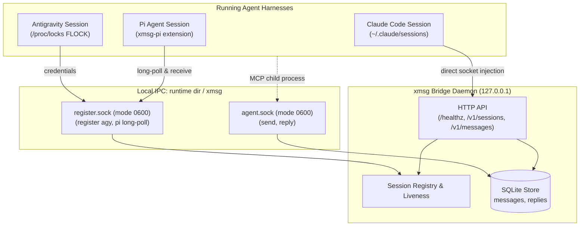

# xmsg: Local Inter-Agent Messaging & Coordination Bridge

`xmsg` is a fast, lightweight local messaging bridge connecting running AI agent sessions across harnesses (Claude Code, Antigravity, and Pi) on the local host. It provides direct, zero-overhead inbox delivery, attested caller identification, persistent reply threading, and MCP tooling.

---

## 1. Security Architecture & Trust Model

### 1.1 Same-UID Trust Boundary
All local IPC in `xmsg` relies on Unix domain sockets located in `$XDG_RUNTIME_DIR/xmsg/` (mode `0700` directory, socket mode `0600`, owned by the running user's UID). On macOS, when `XDG_RUNTIME_DIR` is unset, the runtime dir is the per-user Darwin temp dir (`getconf DARWIN_USER_TEMP_DIR`, also a `0700` directory):
- Sockets authenticate connected peers via kernel-attested credentials (`SO_PEERCRED` on Linux, `getpeereid` and `LOCAL_PEEREPID` on macOS). On macOS the peer PID is the last process to use the socket, not the one that connected as with `SO_PEERCRED`; they differ only when a connected socket is shared between processes before `accept`, and the UID check is unaffected.
- Any process executing under the **same local UID** is within the trust boundary and may connect to the Unix sockets.
- Sockets are protected against symlink attacks and race conditions on startup by verifying directory ownership and permissions prior to binding.

### 1.2 No-Authentication HTTP Posture
> [!WARNING]
> **No-Auth HTTP Service**: The `xmsg` HTTP server provides **no authentication mechanisms**. It is designed solely for local inter-process communication and **MUST STRICTLY bind to the loopback interface (`127.0.0.1`)**. Never expose the HTTP port to external networks, shared interfaces, or container bridges without a dedicated authenticating proxy.

### 1.3 Attestation & Identity Derivation
`xmsg` prevents cross-session and cross-harness impersonation among non-adversarial same-UID processes:
- **Claude Sessions:** Discovered via `~/.claude/sessions` and verified for process liveness and starttime continuity via `/proc/<pid>/stat` (on macOS via `proc_pidinfo`, matching to the second the UTC `ps -o lstart` text Claude Code records as `procStart`; local-time renderings are rejected).
- **Antigravity Sessions:** Verified via dual attestation: the registering peer's ancestor chain is traversed to find a process matching a configured trusted executable (`--agy-exe`) that has the presence lock file descriptor `<presence_dir>/<conversation_id>.lock` open (matched by canonical device and inode numbers). The server derives the session key `agy:<pid>:<starttime>`, and subsequent liveness is tracked by PID and start time. On Linux, `/proc/locks` is checked additionally to confirm exclusive FLOCK ownership. On macOS, Darwin XNU kernel does not expose unprivileged APIs to identify the holder of a BSD `flock(2)` lock (`proc_pidfdinfo` has no lock state, and while `fcntl(F_GETLK)` queries the per-vnode lock list and can detect conflicting `F_FLOCK` locks via `lf_getlock` in `bsd/kern/kern_lockf.c`, it sets `fl->l_pid = -1` because non-POSIX flock locks record no owner PID). Thus Darwin provides no unprivileged API to attribute `flock(2)` ownership to a specific PID or distinguish the active holder from an exec-inheritor. macOS operates under Option B: verifying the trusted executable (`proc_pidpath`) and open file descriptor vnode `(vst_dev, vst_ino)` without FLOCK holder verification, accepting that inherited descriptors across exec satisfy the check (documented in `docs/probes/macos-agy.md`).
- **Pi Sessions:** Session identity is **server-derived** from attested kernel process parameters:
  ```text
  sessionId = "pi:" || peer_pid || ":" || starttime
  ```
  Caller-asserted session IDs in registration payloads are completely ignored.
- **Process Verification (Pi):** When `--pi-entrypoint` is configured, `xmsg` verifies that the process executable is `node` (or `--pi-node-bin` / `XMSG_PI_NODE_BIN` if specified), that arguments before the script do not begin with `-`, and that the script entrypoint argument (`args[1]`) canonicalizes against `/proc/<pid>/cwd` to a trusted path. When `--pi-entrypoint` is not configured, `xmsg` falls back to the legacy command-line heuristic (`is_pi_cmdline`), which is weaker as it only inspects `argv` without verifying the executable or script binary.
  **Important:** This verification inspects command-line arguments and process working directory; it operates as a misconfiguration guard against accidental registrations, rather than an airtight cryptographic identity proof against malicious same-UID processes. In particular, it does not inspect environment variables (such as `NODE_OPTIONS`) or detect runtime argv rewriting (such as `process.title`).
- **Fail-Closed Executable Resolution:** Executable path resolution fails closed on deleted binaries (`<path> (deleted)`) and upgraded profile symlinks where the canonical target has changed or no longer exists.
- **Attested Badges & Harness Binding:** The attested sender badge formats as:
  ```text
  fromName = "xmsg@" || host_label || " · " || caller.harness || ":" || cleaned_name
  ```
  The harness (`claude:`, `pi:`, `agy:`) and process binding are cryptographically/kernel-attested by `xmsg`, while the display name is chosen by the session.
- **Ancestor Process Walk:** For calls to `agent.sock` (such as MCP tools spawned in child shells), `xmsg` traverses parent PIDs upwards through `/proc/<pid>/stat` (`proc_pidinfo` on macOS) to identify the originating agent session.
- **Harness-Bound Reply Authorization:** All stored messages record the recipient harness (`claude`, `agy`, or `pi`). A reply is accepted only when:
  ```text
  caller.harness == msg.recipient_harness && caller.session_id == msg.session_id
  ```

### 1.4 Envelope Sanitization & Breakout Protection
- **Printable-ASCII Sender Enforcement:** HTTP sender names are strictly restricted to printable ASCII characters (`0x20` to `0x7E`) and cannot contain `:` or `/`. Because `:` is prohibited over HTTP, unauthenticated callers can never forge the attested badge separator `:` by mathematical construction.
- **Attested Visual Badges:** The `xmsg@<host> · <harness>:<name>` badge is strictly generated internally for authenticated socket callers.
- **Sender Sanitization:** Sender names are stripped of quotes, angle brackets, control characters, and newlines, and capped at 64 characters across all sinks (`assemble_envelope`, inbox headers, and UI titles).
- **XML Breakout Defense:** The transport envelope escapes attribute double quotes (`&quot;`), guaranteeing that the `<cross-session-message>` XML tag cannot be broken out of.

---

## 2. IPC Sockets & Components



`xmsg` operates two Unix domain sockets in `$XDG_RUNTIME_DIR/xmsg/`, or the Darwin user temp dir on macOS (created with file permissions mode `0600`):

### 2.1 `agent.sock`
Used by active agent sessions and MCP tool instances:
- **`send` action:** Formats an attested sender badge `xmsg@<host> · <harness>:<name>`, enforces payload limits (`max_body`), derives kernel-attested return address (`return_harness`, `return_session_id`), and delivers directly to the recipient session. Supports optional `"push_replies": bool` (defaults to `true`). Callers cannot supply or spoof return addresses.
- **`reply` action:** Validates caller identity via ancestor walk, verifies recipient authorization against SQLite records, and records the reply. If the original message has an attested return address and `push_replies` is enabled, pushes the reply directly into the original sender's adapter (Claude channel socket, Antigravity `agentapi`, or Pi queue) with conversational threading (`thread_id`), returning `push_outcome` (`pushed`, `sender_gone`, `push_failed`, or `disabled`).

### 2.2 `register.sock`
Used by non-Claude harnesses for registration and polling:
- **Antigravity Registration:** `xmsg register agy` sends session credentials (`conversation_id`, `ls_address`, `csrf_token`) over this socket to enable outbound HTTP message injection into Antigravity.
- **Pi Registration & Polling:** The Pi extension registers its process and enters an event-driven long-poll loop to receive inbound messages.

### 2.3 Return Address & Reply Push Delivery (Unit U8)
- **Strictly Derived Return Address:** The server derives `return_harness = caller.harness` and `return_session_id = caller.session_id` directly from kernel process attestation. Any caller-supplied address fields are strictly rejected. Anonymous HTTP sends have `return_harness = None` and `push_replies = false`.
- **Push Opt-Out:** Senders can pass `"push_replies": false` to opt out of asynchronous push delivery. Replies to opt-out messages record `push_outcome = "disabled"` without attempting delivery.
- **Envelope Header & Threading:** Pushed replies are inserted as full first-class messages with a new ULID `id`, reciprocal return address, and `thread_id` pointing to the originating message. The delivered envelope begins with:
  ```text
  [xmsg] reply to message_id=<orig_id> — message_id=<new_id>; reply with the xmsg reply tool
  ```
  This enables persistent bidirectional conversational threading across disparate harnesses.
- **Push Outcomes:** Recorded in the `replies` table:
  - `pushed`: Successfully delivered to recipient adapter.
  - `sender_gone`: Original sender socket or process no longer exists.
  - `push_failed`: Transient error or adapter connection failure.
  - `disabled`: Original sender opted out with `push_replies = false`.

---

## 3. Interfaces & Tooling

### 3.1 Model Context Protocol (MCP) Server: `xmsg mcp`
`xmsg` provides a stdio MCP server for agent harnesses:
```json
{
  "mcpServers": {
    "xmsg": {
      "command": "xmsg",
      "args": ["mcp"]
    }
  }
}
```
Exposes three tools (all execute autonomously without user interaction prompts):
- **`list`:** Enumerate active agent sessions across all harnesses.
- **`send(ref, text, [push_replies])`:** Send a message to a session ref (derives attested caller identity and return address; callers cannot override the sender).
- **`reply(message_id, text)`:** Reply to a received message by its `message_id` (enforces recipient authorization and pushes to the original sender if return address exists).

### 3.2 Pi Coding Agent Extension: `extensions/pi/`
TypeScript extension for Pi (`@earendil-works/pi-coding-agent`):
- Connects to `register.sock`, receives server-derived session ID, and long-polls for inbound messages.
- Defaults session display name to the directory basename of the working directory.
- Delivers incoming messages into Pi with `expandPromptTemplates: false` to prevent remote command or prompt template injection.
- Registers three tools:
  - **`list`:** Queries active sessions via local HTTP.
  - **`send`:** Sends messages over `agent.sock` to ensure kernel attestation of peer PID and return address.
  - **`reply`:** Sends replies over `agent.sock`.

### 3.3 Antigravity Integration: `xmsg register agy`
Registers local Antigravity credentials with the running `xmsg` server over `register.sock`, allowing seamless bidirectional messaging.

---

## 4. HTTP API Reference

### Health & Sessions
- `GET /healthz`: Server health check.
- `GET /v1/sessions`: List active sessions (supports `?cwd=`, `?status=busy|idle`).
- `GET /v1/sessions/{ref}`: Get single session details by ID, PID, or name.

### Messaging
- `POST /v1/sessions/{ref}/messages`: Inject a message into a session inbox.
  ```json
  {
    "from": "alice-orchestrator",
    "text": "Hello, please review unit tests."
  }
  ```
  Returns `202 Accepted` with ULID `messageId`:
  ```json
  {
    "sessionId": "live-session-1234",
    "fromName": "xmsg@hostname · alice-orchestrator",
    "bytes": 35,
    "messageId": "01J9XYZ..."
  }
  ```

### Replies & Long-Polling
- `GET /v1/messages/{id}`: Retrieve message metadata and all thread replies.
- `GET /v1/messages/{id}/replies?after={seq}&wait={seconds}`: Long-poll for replies (bounded to 60s timeout, max 128 concurrent waiters).

---

## 5. Building & Verification

```bash
# Run Rust test suite
cargo test --all-targets

# Run Clippy lints
cargo clippy --all-targets -- -D warnings

# Check code formatting
cargo fmt -- --check

# Test Pi extension (test.mjs needs a node-based pi install; test-paths.mjs runs anywhere)
node extensions/pi/test.mjs
node extensions/pi/test-paths.mjs

# Build Nix package
nix build .#default --no-link

# Run Nix CI checks
nix flake check ci
```
